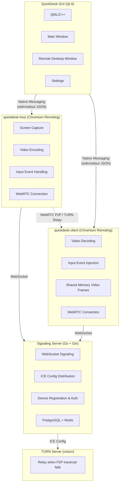

<p align="center">
  
</p>

<h1 align="center">QuickDesk</h1>

<p align="center">
  <strong>Open-Source, Free, High-Performance Remote Desktop</strong><br>
  Built on Chromium Remoting · Pure C++ · Self-Hosted
</p>

<p align="center">
  <a href="https://github.com/barry-ran/QuickDesk/actions/workflows/quickdesk-windows.yml">
    
  </a>
  <a href="https://github.com/barry-ran/QuickDesk/actions/workflows/quickdesk-macos.yml">
    
  </a>
  <a href="https://github.com/barry-ran/QuickDesk/releases">
    
  </a>
  <a href="https://github.com/barry-ran/QuickDesk/stargazers">
    
  </a>
  <a href="LICENSE">
    
  </a>
</p>

<p align="center">
  English | <a href="README_zh.md">中文</a>
</p>

<p align="center">
  <a href="https://t.me/+utsmSUhNLc1iNTY1">Telegram</a> | <a href="https://github.com/barry-ran/QuickDesk/issues">Issues</a> | <a href="https://github.com/barry-ran/QuickDesk/releases">Download</a>
</p>

---

QuickDesk is an **open-source, free** remote desktop application built on Google Chromium Remoting technology, developed entirely in **pure C++**. It is the **first commercial-grade, pure C++ open-source remote desktop software**.

Chromium Remoting is the underlying technology behind Google Chrome Remote Desktop, battle-tested for over a decade at massive scale, serving hundreds of millions of users worldwide with industrial-grade performance, stability, and security. QuickDesk stands on the shoulders of Chromium to deliver a freely deployable, fully data-sovereign remote desktop solution.

Main Interface


Remote Desktop


## Why QuickDesk?

- **Open-Source & Free**: MIT License, no feature restrictions, no connection limits, commercial use welcome
- **Self-Hosted**: Deploy your own signaling and TURN relay servers, keep full control of your data
- **Commercial-Grade Foundation**: Built on Chromium Remoting — the same technology powering Chrome Remote Desktop, refined by Google for 10+ years and proven by billions of users
- **Pure C++ Ultimate Performance**: Full C++ stack from protocol core to GUI — no GC pauses, no runtime overhead, minimal memory and CPU footprint
- **Modern Codecs**: H.264, VP8, VP9, AV1 — flexibly switch based on network and hardware conditions
- **WebRTC P2P Direct Connection**: Prioritizes peer-to-peer connections for lowest latency; automatically falls back to TURN relay when traversal fails
- **Cross-Platform**: Windows and macOS supported (Linux planned)
- **Modern UI**: Fluent Design interface built with Qt 6 + QML, with light and dark themes

## Comparison

| Feature | QuickDesk | RustDesk | BildDesk | ToDesk | TeamViewer |
|---------|:---------:|:--------:|:--------:|:------:|:----------:|
| **Open Source** | ✅ MIT | ✅ AGPL-3.0 | ❌ | ❌ | ❌ |
| **Free for Commercial Use** | ✅ | ❌ License required | ❌ | ❌ | ❌ |
| **Core Language** | C++ | Rust + Dart | — | — | — |
| **Remote Protocol** | Chromium Remoting (WebRTC) | Custom | Custom | Custom | Custom |
| **Protocol Maturity** | ⭐⭐⭐⭐⭐ Google 10yr+ | ⭐⭐⭐ | ⭐⭐ | ⭐⭐⭐ | ⭐⭐⭐⭐⭐ |
| **P2P Direct** | ✅ WebRTC ICE | ✅ TCP Hole Punching | ✅ | ✅ | ✅ |
| **Video Codecs** | H.264/VP8/VP9/AV1 | VP8/VP9/AV1/H.264/H.265 | — | — | — |
| **Self-Hosted** | ✅ Full solution | ✅ | ❌ | ❌ | ❌ |
| **GUI Framework** | Qt 6 (C++) | Flutter (Dart) | — | — | — |
| **Memory Usage** | ⭐⭐⭐⭐⭐ Very Low | ⭐⭐⭐ Medium | — | ⭐⭐⭐ | ⭐⭐⭐ |
| **CPU Usage** | ⭐⭐⭐⭐⭐ Very Low | ⭐⭐⭐ Medium | — | ⭐⭐⭐ | ⭐⭐⭐ |
| **Windows** | ✅ | ✅ | ✅ | ✅ | ✅ |
| **macOS** | ✅ | ✅ | ✅ | ✅ | ✅ |
| **Linux** | 🔜 | ✅ | ❌ | ✅ | ✅ |
| **iOS/Android** | 🔜 | ✅ | ✅ | ✅ | ✅ |

### Why Best-in-Class Performance?

1. **Pure C++ Full Stack**: The entire stack — from low-level protocol to GUI — is implemented in C++. No garbage collection pauses, no VM/runtime overhead. Compared to RustDesk's Dart/Flutter GUI layer or ToDesk's Electron-based approach, CPU and memory usage are significantly lower.

2. **Chromium-Level Optimization**: Core paths for video encoding/decoding, network transmission, and screen capture directly reuse Chromium's highly optimized C++ code, including SIMD instruction optimization and zero-copy rendering pipelines.

3. **Shared Memory Video Transfer**: QuickDesk uses shared memory to pass video frames (YUV I420) between processes, eliminating the serialization/deserialization and data copying overhead of traditional IPC.

4. **GPU-Accelerated Rendering**: YUV data is fed directly into the GPU rendering pipeline via Qt 6's `QVideoSink`, achieving zero-CPU-copy video rendering.

## Features

### Remote Control
- High-definition, low-latency remote desktop display
- Full keyboard and mouse mapping
- Real-time remote cursor synchronization
- Bidirectional clipboard sync
- Adaptive frame rate and bitrate
- Frame rate boost mode (Office / Gaming)

### Connection Management
- 9-digit Device ID + temporary access code mechanism
- Auto-refresh access code (configurable: 30 min to 24 hours, or never)
- Multi-tab simultaneous connections to multiple remote devices
- Connection history with quick reconnect
- Real-time connection status monitoring

### Performance Monitoring
- Detailed latency breakdown panel (Capture → Encode → Network → Decode → Render)
- Real-time frame rate, bitrate, and bandwidth statistics
- Input round-trip time (RTT) monitoring
- Encoding resolution and quality information

### Personalization
- Fluent Design style interface
- Light and dark theme switching
- i18n support (Chinese / English)
- Video codec preference (H.264 / VP8 / VP9 / AV1)

### Self-Hosted Deployment
- Custom signaling server address
- Custom STUN/TURN servers
- Complete server deployment solution (Go signaling server + PostgreSQL + Redis + coturn)

## Architecture

QuickDesk uses a modular multi-process architecture:



### Tech Stack

| Layer | Technology |
|-------|------------|
| GUI Client | Qt 6 (QML + C++17) |
| UI Style | Fluent Design Component Library (custom-built) |
| Remote Protocol Core | Chromium Remoting (C++) |
| Video Codecs | H.264 / VP8 / VP9 / AV1 |
| Network Transport | WebRTC (ICE/STUN/TURN) |
| IPC | Native Messaging (JSON) + Shared Memory |
| Signaling Server | Go + Gin + GORM |
| Data Storage | PostgreSQL + Redis |
| TURN Relay | coturn |
| Logging | spdlog |
| Build System | CMake 3.19+ |
| CI/CD | GitHub Actions |

## Getting Started

### Download

Go to [Releases](https://github.com/barry-ran/QuickDesk/releases) to download the latest version:

| Platform | Download |
|----------|----------|
| Windows x64 | [QuickDesk-win-x64-setup.exe](https://github.com/barry-ran/QuickDesk/releases/latest) |
| macOS ARM64 | [QuickDesk-mac-arm64.dmg](https://github.com/barry-ran/QuickDesk/releases/latest) |

### Usage

1. Install and run QuickDesk on both the **host** (remote) and **client** (local) machines
2. The host will automatically generate a **Device ID** and **Access Code**
3. On the client, enter the host's Device ID and Access Code, then click **Connect**
4. You're now remotely controlling the host machine

## Build from Source

### Requirements

- CMake 3.19+
- Qt 6.5+ (Multimedia and WebSockets modules required)
- C++17 compiler

### Windows

```bash
# Requires Visual Studio 2022 + MSVC
# Set Qt path environment variable
set ENV_QT_PATH=C:\Qt\6.8.3

# Build
scripts\build_qd_win.bat Release

# Package (requires Inno Setup)
scripts\publish_qd_win.bat Release
scripts\package_qd_win.bat Release
```

### macOS

```bash
# Requires Xcode Command Line Tools
# Set Qt path environment variable
export ENV_QT_PATH=/path/to/Qt/6.8.3

# Build
bash scripts/build_qd_mac.sh Release

# Package
bash scripts/publish_qd_mac.sh Release
bash scripts/package_qd_mac.sh Release
```

### API Key (Optional)

If you deploy your own signaling server with API Key enabled, you can inject the API Key at build time so your clients can authenticate:

```bash
# Windows
set ENV_QUICKDESK_API_KEY=your-secret-key
scripts\build_qd_win.bat Release

# macOS
ENV_QUICKDESK_API_KEY=your-secret-key bash scripts/build_qd_mac.sh Release
```

Without `ENV_QUICKDESK_API_KEY`, the build produces an open-source client that can only connect to signaling servers without API Key protection.

> **WebClient note:** The WebClient is a static web page running in the browser. Since API keys embedded in JavaScript are visible via DevTools, the WebClient uses **Origin whitelist** validation instead of API Key. Configure `ALLOWED_ORIGINS` on the signaling server to restrict which domains can access it. Browsers automatically send the `Origin` header and JavaScript cannot forge it, so only the WebClient served from your official domain will be allowed.

See [Signaling Server Deployment](docs/signaling-server-deployment.md) for details.

## Self-Hosted Deployment

QuickDesk supports full self-hosted deployment. You can deploy all services on your own servers to ensure data security.

### Components

1. **Signaling Server** (required): Handles device registration and signaling relay
2. **TURN Relay Server** (recommended): Provides relay when P2P direct connection fails

For a detailed deployment guide, see [Signaling Server Deployment](docs/signaling-server-deployment.md).

### Client Configuration

In QuickDesk **Settings → Network**:
- Signaling server address: `ws://your-server.com:8000` or `wss://your-server.com:8000`
- Custom STUN server: `stun:your-server.com:3478`
- Custom TURN server: `turn:your-server.com:3478` (username and password required)

## Project Structure

```
QuickDesk/
├── QuickDesk/                    # Qt GUI client
│   ├── main.cpp                  # Application entry point
│   ├── src/
│   │   ├── controller/           # Main controller
│   │   ├── manager/              # Business managers (Host/Client/Process/TURN/...)
│   │   ├── component/            # Video rendering, key mapping, cursor sync
│   │   ├── core/                 # Config center, user data
│   │   ├── viewmodel/            # MVVM ViewModel
│   │   └── language/             # i18n
│   ├── qml/
│   │   ├── views/                # Main window, remote desktop window
│   │   ├── pages/                # Remote control, settings, about pages
│   │   ├── component/            # Fluent Design component library
│   │   └── quickdeskcomponent/   # QuickDesk-specific components
│   ├── base/                     # Base utilities
│   └── infra/                    # Infrastructure (database, logging, HTTP)
├── SignalingServer/              # Go signaling server
│   ├── cmd/signaling/            # Entry point
│   └── internal/                 # Business logic
├── cmake/                        # CMake modules
├── scripts/                      # Build, package, publish scripts
├── .github/workflows/            # CI/CD configuration
└── version                       # Version number
```

## Roadmap

- [x] Windows support
- [x] macOS support
- [x] P2P direct connection + TURN relay
- [x] Multi-tab multi-connection
- [x] Auto-refresh access code
- [x] Video performance stats overlay
- [x] Fluent Design UI
- [x] Light and dark themes
- [x] i18n (Chinese / English)
- [ ] Linux support
- [ ] File transfer
- [ ] Audio streaming
- [ ] iOS / Android clients
- [ ] Unattended access
- [ ] Address book & device groups

## Contributing

Contributions are welcome! Please follow these guidelines:

1. Fork the repository and create a feature branch
2. Keep code style consistent with the project
3. Ensure the build passes before submitting a PR
4. Each PR should contain a single feature or fix

## License

QuickDesk's own code is licensed under the [MIT License](LICENSE), free for commercial use.

The bundled `quickdesk-remoting` component is based on Chromium and licensed under the [BSD 3-Clause License](https://chromium.googlesource.com/chromium/src/+/refs/heads/main/LICENSE).

For complete third-party license information, see [THIRD_PARTY_LICENSES](THIRD_PARTY_LICENSES).

## Acknowledgments

- [Chromium Remoting](https://chromium.googlesource.com/chromium/src/+/refs/tags/140.0.7339.249/remoting/) — Remote desktop protocol core
- [Qt](https://www.qt.io/) — Cross-platform GUI framework
- [spdlog](https://github.com/gabime/spdlog) — High-performance logging library
- [coturn](https://github.com/coturn/coturn) — TURN relay server

## Star History

[](https://star-history.com/#barry-ran/QuickDesk&Date)
