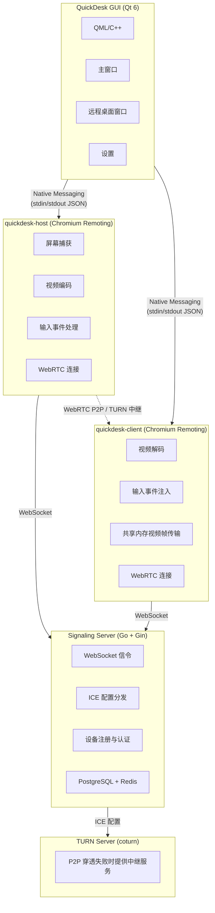

<p align="center">
  
</p>

<h1 align="center">QuickDesk</h1>

<p align="center">
  <strong>开源、免费、高性能的远程桌面软件</strong><br>
  基于 Chromium Remoting 架构 · 纯 C++ 打造 · 支持私有化部署
</p>

<p align="center">
  <a href="https://github.com/barry-ran/QuickDesk/actions/workflows/quickdesk-windows.yml">
    
  </a>
  <a href="https://github.com/barry-ran/QuickDesk/actions/workflows/quickdesk-macos.yml">
    
  </a>
  <a href="https://github.com/barry-ran/QuickDesk/releases">
    
  </a>
  <a href="https://github.com/barry-ran/QuickDesk/stargazers">
    
  </a>
  <a href="LICENSE">
    
  </a>
</p>

<p align="center">
  <a href="README.md">English</a> | 中文
</p>

<p align="center">
  <a href="https://qm.qq.com/q/VON417Xdyo">QQ 交流群</a> | <a href="https://github.com/barry-ran/QuickDesk/issues">Issues</a> | <a href="https://github.com/barry-ran/QuickDesk/releases">下载</a>
</p>

---

QuickDesk 是一款**开源免费**的远程桌面控制软件，基于 Google Chromium Remoting 技术架构，采用**纯 C++** 开发，是目前**第一款商用级别的纯 C++ 开源远程桌面软件**。

Chromium Remoting 是 Google Chrome Remote Desktop 的底层技术，经过十多年的大规模商用验证，服务全球数亿用户，在性能、稳定性和安全性上都达到了工业级水准。QuickDesk 站在 Chromium 的肩膀上，为用户提供一个可自由部署、完全掌控数据的远程桌面解决方案。

主界面


远程桌面


## 为什么选择 QuickDesk？

- **开源免费**：MIT 许可证，商用无忧，无功能限制，无连接数限制
- **私有化部署**：自建信令服务器和 TURN 中继服务器，数据完全掌控在自己手中
- **商用级底座**：基于 Chromium Remoting —— 驱动 Chrome Remote Desktop 的同一套技术，经过 Google 十年+打磨、全球亿级用户验证
- **纯 C++ 极致性能**：从远程协议核心到 GUI 应用全栈 C++，无 GC 停顿、无运行时开销，内存和 CPU 占用极低
- **现代编解码**：支持 H.264、VP8、VP9、AV1 等多种编码，可根据网络和硬件灵活切换
- **WebRTC P2P 直连**：优先建立端到端直连，延迟最低；穿透失败自动回退 TURN 中继
- **跨平台**：支持 Windows 和 macOS（Linux 计划中）
- **现代化 UI**：Qt 6 + QML 打造的 Fluent Design 风格界面，支持明暗主题

## 竞品对比

| 特性 | QuickDesk | RustDesk | BildDesk | ToDesk | TeamViewer |
|------|:---------:|:--------:|:--------:|:------:|:----------:|
| **开源** | ✅ MIT | ✅ AGPL-3.0 | ❌ | ❌ | ❌ |
| **免费商用** | ✅ | ❌ 需商业授权 | ❌ | ❌ | ❌ |
| **核心语言** | C++ | Rust + Dart | — | — | — |
| **远程协议** | Chromium Remoting (WebRTC) | 自研 | 自研 | 自研 | 自研 |
| **协议成熟度** | ⭐⭐⭐⭐⭐ Google 10年+商用 | ⭐⭐⭐ | ⭐⭐ | ⭐⭐⭐ | ⭐⭐⭐⭐⭐ |
| **P2P 直连** | ✅ WebRTC ICE | ✅ TCP 打洞 | ✅ | ✅ | ✅ |
| **视频编码** | H.264/VP8/VP9/AV1 | VP8/VP9/AV1/H.264/H.265 | — | — | — |
| **私有化部署** | ✅ 完整方案 | ✅ | ❌ | ❌ | ❌ |
| **GUI 框架** | Qt 6 (C++) | Flutter (Dart) | — | — | — |
| **内存占用** | ⭐⭐⭐⭐⭐ 极低 | ⭐⭐⭐ 中等 | — | ⭐⭐⭐ | ⭐⭐⭐ |
| **CPU 占用** | ⭐⭐⭐⭐⭐ 极低 | ⭐⭐⭐ 中等 | — | ⭐⭐⭐ | ⭐⭐⭐ |
| **Windows** | ✅ | ✅ | ✅ | ✅ | ✅ |
| **macOS** | ✅ | ✅ | ✅ | ✅ | ✅ |
| **Linux** | 🔜 | ✅ | ❌ | ✅ | ✅ |
| **iOS/Android** | 🔜 | ✅ | ✅ | ✅ | ✅ |

### 为什么性能最好？

1. **纯 C++ 全栈**：从底层协议到上层 GUI 全部使用 C++ 实现，无 GC（垃圾回收）带来的停顿抖动，无 VM/Runtime 开销。相比 RustDesk 的 Dart/Flutter GUI 层、ToDesk 等使用 Electron 的方案，CPU 和内存占用显著更低。

2. **Chromium 级别优化**：视频编解码、网络传输、屏幕捕获等核心路径直接复用 Chromium 中经过极致性能调优的 C++ 代码，包括 SIMD 指令优化、零拷贝渲染管线等。

3. **共享内存视频传输**：QuickDesk 采用共享内存在进程间传递视频帧（YUV I420），避免了传统 IPC 的序列化/反序列化和数据拷贝开销。

4. **GPU 加速渲染**：通过 Qt 6 的 `QVideoSink` 直接将 YUV 数据送入 GPU 渲染管线，实现零 CPU 拷贝的视频渲染。

## 功能

### 远程控制
- 高清低延迟远程桌面显示
- 键盘和鼠标完整映射控制
- 远程光标实时同步
- 剪贴板双向同步
- 自适应帧率与码率
- 帧率增强模式（办公 / 游戏）

### 连接管理
- 9 位设备 ID + 临时访问码机制
- 访问码自动刷新（可配置 30 分钟~24 小时或永不刷新）
- 多标签页同时连接多台远程设备
- 连接历史记录与快速重连
- 实时连接状态监控

### 性能监控
- 详细的延迟分解面板（捕获 → 编码 → 网络 → 解码 → 渲染）
- 实时帧率、码率、带宽统计
- 输入往返时延（Input RTT）监测
- 编码分辨率、编码质量信息

### 个性化
- Fluent Design 风格界面
- 明暗主题切换
- 中英文国际化支持
- 视频编码偏好设置（H.264 / VP8 / VP9 / AV1）

### 私有化部署
- 自定义信令服务器地址
- 自定义 STUN/TURN 服务器
- 完整的服务端部署方案（Go 信令服务器 + PostgreSQL + Redis + coturn）

## 架构

QuickDesk 采用模块化多进程架构：



### 技术栈

| 层级 | 技术 |
|------|------|
| GUI 客户端 | Qt 6 (QML + C++17) |
| UI 风格 | Fluent Design 组件库（自研） |
| 远程协议核心 | Chromium Remoting (C++) |
| 音视频编解码 | H.264 / VP8 / VP9 / AV1 |
| 网络传输 | WebRTC (ICE/STUN/TURN) |
| 进程间通信 | Native Messaging (JSON) + 共享内存 |
| 信令服务器 | Go + Gin + GORM |
| 数据存储 | PostgreSQL + Redis |
| TURN 中继 | coturn |
| 日志 | spdlog |
| 构建系统 | CMake 3.19+ |
| CI/CD | GitHub Actions |

## 快速开始

### 下载安装

前往 [Releases](https://github.com/barry-ran/QuickDesk/releases) 下载最新版本：

| 平台 | 下载 |
|------|------|
| Windows x64 | [QuickDesk-win-x64-setup.exe](https://github.com/barry-ran/QuickDesk/releases/latest) |
| macOS ARM64 | [QuickDesk-mac-arm64.dmg](https://github.com/barry-ran/QuickDesk/releases/latest) |

### 使用方法

1. 在**被控端**和**主控端**分别安装并运行 QuickDesk
2. 被控端会自动生成 **设备 ID** 和 **访问码**
3. 在主控端输入被控端的设备 ID 和访问码，点击**连接**
4. 连接成功后即可远程控制

## 从源码编译

### 环境要求

- CMake 3.19+
- Qt 6.5+（需要 Multimedia、WebSockets 模块）
- C++17 编译器

### Windows

```bash
# 需要 Visual Studio 2022 + MSVC
# 设置 Qt 路径环境变量
set ENV_QT_PATH=C:\Qt\6.8.3

# 编译
scripts\build_qd_win.bat Release

# 打包（需要 Inno Setup）
scripts\publish_qd_win.bat Release
scripts\package_qd_win.bat Release
```

### macOS

```bash
# 需要 Xcode Command Line Tools
# 设置 Qt 路径环境变量
export ENV_QT_PATH=/path/to/Qt/6.8.3

# 编译
bash scripts/build_qd_mac.sh Release

# 打包
bash scripts/publish_qd_mac.sh Release
bash scripts/package_qd_mac.sh Release
```

### API Key（可选）

如果你部署了自己的信令服务器并启用了 API Key，可以在编译时注入 API Key 使客户端能够通过认证：

```bash
# Windows
set ENV_QUICKDESK_API_KEY=your-secret-key
scripts\build_qd_win.bat Release

# macOS
ENV_QUICKDESK_API_KEY=your-secret-key bash scripts/build_qd_mac.sh Release
```

不设置 `ENV_QUICKDESK_API_KEY` 时，编译出的客户端只能连接未开启 API Key 保护的信令服务器。

> **WebClient 说明：** WebClient 是运行在浏览器中的静态网页，嵌入到 JS 中的 API Key 可通过 DevTools 看到，因此 WebClient 采用 **Origin 域名白名单** 验证而非 API Key。在信令服务器配置 `ALLOWED_ORIGINS` 来限制允许访问的域名。浏览器会自动发送 `Origin` 请求头且 JavaScript 无法伪造，只有从官方域名加载的 WebClient 才能通过验证。

详情参见[信令服务器部署文档](docs/信令服务器部署.md)。

## 私有化部署

QuickDesk 支持完整的私有化部署，你可以将所有服务部署在自己的服务器上，确保数据安全。

### 部署组件

1. **信令服务器**（必需）：负责设备注册、信令转发
2. **TURN 中继服务器**（推荐）：在 P2P 直连失败时提供中继

详细部署指南请参考 [信令服务器文档](docs/信令服务器部署.md)。

### 客户端配置

在 QuickDesk **设置 → 网络** 中配置：
- 信令服务器地址：`ws://your-server.com:8000` 或 `wss://your-server.com:8000`
- 自定义 STUN 服务器：`stun:your-server.com:3478`
- 自定义 TURN 服务器：`turn:your-server.com:3478`（需提供用户名和密码）

## 项目结构

```
QuickDesk/
├── QuickDesk/                    # Qt GUI 客户端
│   ├── main.cpp                  # 应用入口
│   ├── src/
│   │   ├── controller/           # 主控制器
│   │   ├── manager/              # 业务管理（Host/Client/Process/TURN/...）
│   │   ├── component/            # 视频渲染、按键映射、光标同步
│   │   ├── core/                 # 配置中心、用户数据
│   │   ├── viewmodel/            # MVVM ViewModel
│   │   └── language/             # 国际化
│   ├── qml/
│   │   ├── views/                # 主窗口、远程桌面窗口
│   │   ├── pages/                # 远程控制页、设置页、关于页
│   │   ├── component/            # Fluent Design 通用组件库
│   │   └── quickdeskcomponent/   # QuickDesk 专用组件
│   ├── base/                     # 基础工具库
│   └── infra/                    # 基础设施（数据库、日志、HTTP）
├── SignalingServer/              # Go 信令服务器
│   ├── cmd/signaling/            # 程序入口
│   └── internal/                 # 业务逻辑
├── cmake/                        # CMake 模块
├── scripts/                      # 编译、打包、发布脚本
├── .github/workflows/            # CI/CD 配置
└── version                       # 版本号
```

## 路线图

- [x] Windows 支持
- [x] macOS 支持
- [x] P2P 直连 + TURN 中继
- [x] 多标签页多连接
- [x] 访问码自动刷新
- [x] 视频性能统计面板
- [x] Fluent Design UI
- [x] 明暗主题
- [x] 国际化（中/英）
- [ ] Linux 支持
- [ ] 文件传输
- [ ] 音频传输
- [ ] iOS / Android 客户端
- [ ] 无人值守访问
- [ ] 地址簿与设备分组

## 贡献

欢迎参与 QuickDesk 的开发！请遵循以下规范：

1. Fork 本仓库并创建特性分支
2. 代码风格保持与项目一致
3. 提交 PR 前请确保编译通过
4. 一个 PR 只包含一个功能点或修复

## 许可证

QuickDesk 自身代码基于 [MIT License](LICENSE) 开源，商用无忧。

项目中捆绑的 `quickdesk-remoting` 组件基于 Chromium，遵循 [BSD 3-Clause License](https://chromium.googlesource.com/chromium/src/+/refs/heads/main/LICENSE)。

完整的第三方许可证信息请参见 [THIRD_PARTY_LICENSES](THIRD_PARTY_LICENSES)。

## 致谢

- [Chromium Remoting](https://chromium.googlesource.com/chromium/src/+/refs/tags/140.0.7339.249/remoting/) — 远程桌面协议核心
- [Qt](https://www.qt.io/) — 跨平台 GUI 框架
- [spdlog](https://github.com/gabime/spdlog) — 高性能日志库
- [coturn](https://github.com/coturn/coturn) — TURN 中继服务器

## Star 历史

[](https://star-history.com/#barry-ran/QuickDesk&Date)
